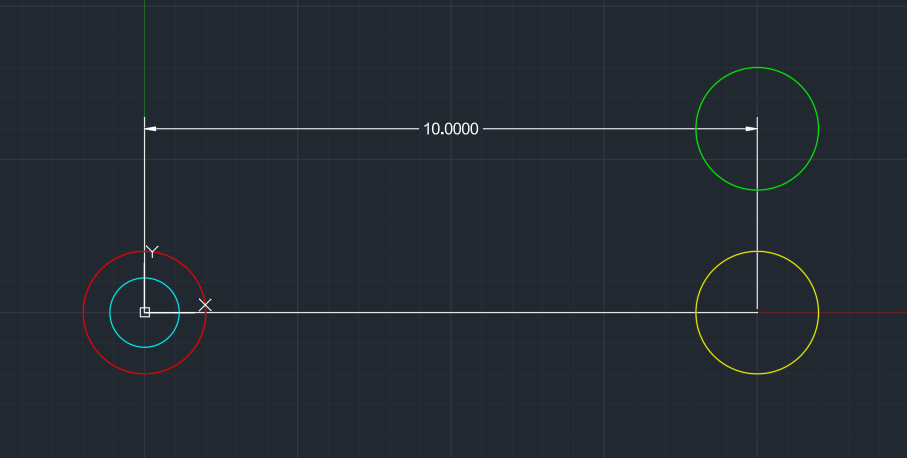

# Dimensions

# Aligned

- RED: `FirstPoint`
- YELLOW: `SecondPoint`
- GREEN: `DefinitionPoint`
- CYAN: `InsertionPoint`

# Linear

- RED: `FirstPoint`
- YELLOW: `SecondPoint`
- GREEN: `DefinitionPoint`
- CYAN: `InsertionPoint`

# Ordinate

- RED: `FeatureLocation`
- YELLOW: `LeaderEndpoint`
- GREEN: `DefinitionPoint`
- CYAN: `InsertionPoint`

# Diameter

- RED: `AngleVertex`
- YELLOW: `Center`
- GREEN: `DefinitionPoint`
- CYAN: `InsertionPoint`

# Radius

- RED: `AngleVertex`
- GREEN: `DefinitionPoint`
- CYAN: `InsertionPoint`

# Angular2Line

- RED: `FirstPoint`
- YELLOW: `SecondPoint`
- BLUE: `AngleVertex`
- MAGENTA: `DimensionArc`
- GREEN: `DefinitionPoint`
- CYAN: `InsertionPoint`

# Angular3pt

- RED: `FirstPoint`
- YELLOW: `SecondPoint`
- BLUE: `AngleVertex`
- GREEN: `DefinitionPoint`
- CYAN: `InsertionPoint`